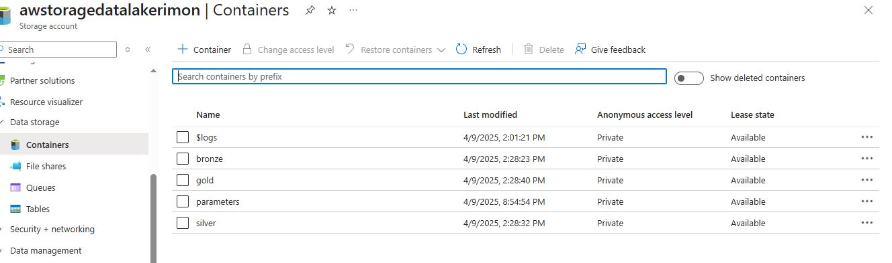
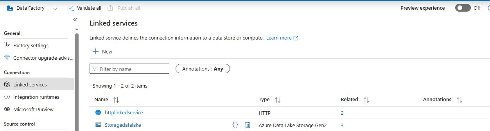
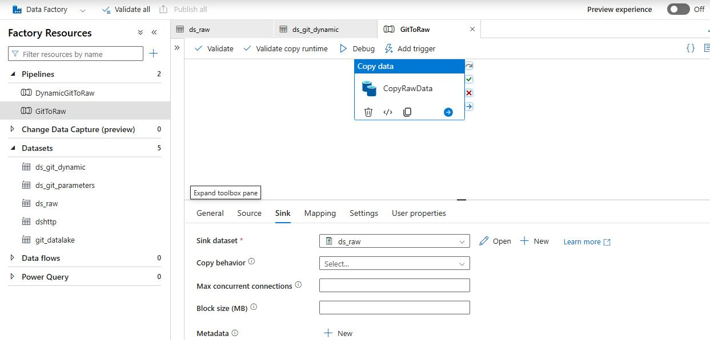
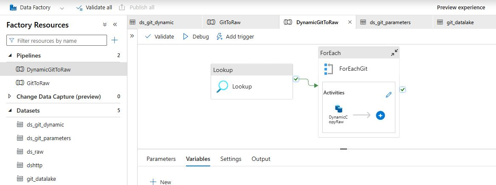
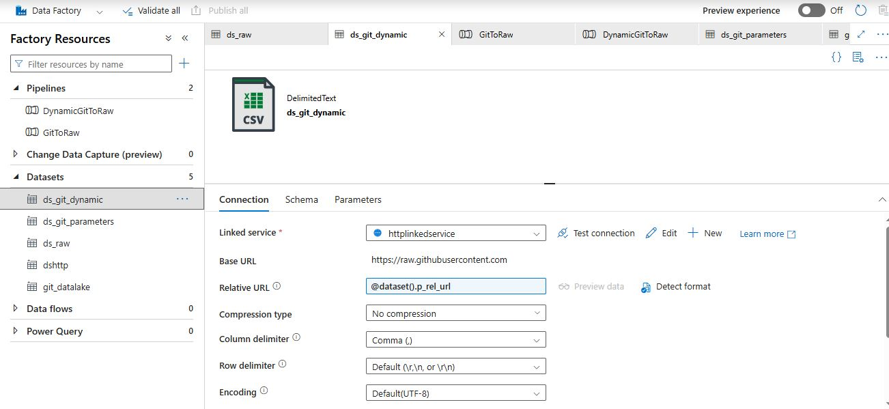
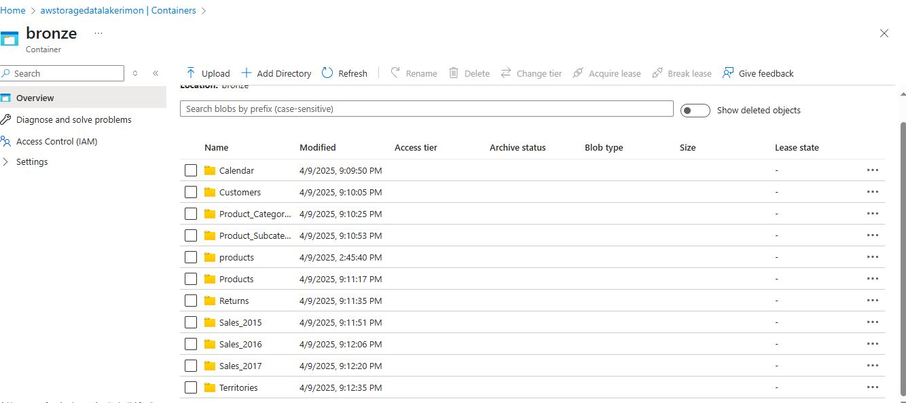

# Adventure_Work_DataEngineering_Project
## Project Review
It is an End-to-End Data Engineering project from scratch where I leverage powerful technologies like Azure Data Factory, Azure Data Lake, Databricks, Azure Synapse Analytics, and Apache Spark.It includes data ingestion, transformation, serving, and reporting, following the medallion architecture (Bronze → Silver → Gold layers).
### The Architecture
1. **Data Source**
     - Source: External APIs via HTTP connections
     - Mechanism: Pull data using API calls (e.g., using Python, Azure Functions, or Logic Apps)
2. **Data Ingestion**
     - Tool: Azure Data Factory
     - Description: A low-code/no-code orchestration tool that is powerful and flexible.
     - Key Feature: We use **dynamic pipelines** with parameters and loops for scalable ingestion.
3. **Medallion Architecture**
     * *Raw Data Store (Bronze Layer)*
         - After pulling the data, it's landed in the Bronze layer, also known as the Raw layer.
         - This is an exact copy of the source data, stored as-is for auditing and reprocessing purposes.
     * *Transformation Layer (Silver Layer)*
         - Tool: Databricks
         - Description: Databricks handles the bulk of the transformation and cleaning process using PySpark.
         - We extract data from the Bronze layer, apply transformations, and push clean data to the Silver layer.
     * *Serving Layer (Gold Layer)*
         - After transformation, the cleaned and enriched data is served to stakeholders.
         - Example consumers: Data Analysts, Data Scientists
         - Common target: Data Warehouse built using Azure Synapse Analytics
4. **Reporting**
     - The final step involves building interactive dashboards using Power BI.
     - We connect Power BI to Azure Synapse or other data stores, pulling relevant fact and dimension tables for analysis
### Data Flow Summarry & Tech Stack
     API (HTTP) → Azure Data Factory (ADF) → Bronze (Raw Data) → Databricks (Transform) → Silver → Synapse (Serve) → Power BI (Report)
     Azure Data Factory (Ingestion & Orchestration)
     Azure Data Lake (Storage: Bronze, Silver, Gold layers)
     Azure Databricks (Transformation using PySpark)
     Azure Synapse Analytics (Data Warehouse)
     Power BI (Visualization & Reporting)

## Phase-I ( Data Loading/Extracting Data to Bronze Layer)
1. **Create Resource Group and Storage Account**  
      - A. Create Resource Group: In Azure, a Resource Group is needed to organize and manage all related resources.  
      - B. Create Storage Account
           - Choose a unique name for the storage account
           - Select Geo-Redundancy options
                * GRS (Geo-Redundant Storage): Replicates data across different regions.  
                * LRS (Locally Redundant Storage): Replicates data within the same region.
2. **Set Up Azure Data Lake**
     Azure Data Lake is created from the Storage Account. It provides a hierarchical namespace, unlike Blob Storage which uses a flat storage structure. Data Lake allows better organization with folders, making it easier to manage big data.Hierarchical complemented by Data Lake Storage Gen2 endpoint,enables file and directory semantic,accelerates big data analytics workloads, and enables access control list (ACLs). We need to create **containers** (Like one container for bronze,one container for silver,then gold so on and conainer name should be lower case letter)
   
3. **Azure Data Factory Setup**
      * Create Azure Data Factory within the Resource Group.
      * This tool is used to create pipelines for data loading to datalake and we use "copy_data".
      * Data Link Service:
         * Set up a Link Service for external data sources like GitHub for that we need to use **manage tab**.
         * GitHub is used here to fetch raw data from files stored in a repository.
         * HTTP is used to fetch raw files also need to create link service for datalake as a destination  
           In github we have to go raw file section and the first part of url is base which will be in the link service and the relative url will be in the source of the pipline.To create dataset go to the source of pipeline and for destination (sink) we choose datalake and we can create folders within the containers we create for each file in the path section.

  
  

  

** **IMPORTANT** ** All of the above is static pipeline, creating "copy_data" again and again for each file which is not time efficiency as well as wasting resources.To get rid of it we need to use dynamic pipeline  

4. **Dynamic Pipeline**  
     * To reduce the repetitive task of creating individual pipelines, dynamic pipelines are created.
     * In a dynamic pipeline, parameters are used for each dataset. For each file, you define:  
       Relative url,one folder and a file name  
       **Basically, for passing dynamic activity for each iteration, we need a for each loop and in that for each loop we put the "copy_data" with parameters. Because of parametrization we can create one dataset of multiple files instead of making multiple datasets**  
5. **Creating the Dynamic Pipeline**
     * Create a pipeline first and drag a "copy data" activity into the canvas.
     * Add Base url in the source file and go to advanced option to make a relative url parameters (using dynamic name convension).
     * Same as for Sink (destination) but in the file path use **bronze** as it is then two different parameters for folder and file name  
     ** **IMPORTANT** ** We need to create one container in datalake for parameters and then in VS code make a json file for 3 parameters load it into that container
     * Create a lookup value in data factory then go to dataset of lookupvalue ,link service to datalake with filepath of that json file with parameters.
     * Create "for each git" from iteration tab and connect it with lookupvalue and in the settings if the "for each git" select sequential and in the items select lookup.output.value. Lastlyy, in the activities of "for each git" put the "copy data" in for each category.
        

**It will load all the file inthe respective container of the datalake**

       
     
      

          
