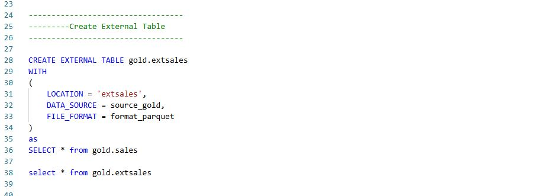

# Adventure_Work_DataEngineering_Project
## Project Review
It is an End-to-End Data Engineering project from scratch where I leverage powerful technologies like Azure Data Factory, Azure Data Lake, Databricks, Azure Synapse Analytics, and Apache Spark.It includes data ingestion, transformation, serving, and reporting, following the medallion architecture (Bronze → Silver → Gold layers).
### The Architecture
1. **Data Source**
     - Source: External APIs via HTTP connections
     - Mechanism: Pull data using API calls (e.g., using Python, Azure Functions, or Logic Apps)
2. **Data Ingestion**
     - Tool: Azure Data Factory
     - Description: A low-code/no-code orchestration tool that is powerful and flexible.
     - Key Feature: We use **dynamic pipelines** with parameters and loops for scalable ingestion.
3. **Medallion Architecture**
     * *Raw Data Store (Bronze Layer)*
         - After pulling the data, it's landed in the Bronze layer, also known as the Raw layer.
         - This is an exact copy of the source data, stored as-is for auditing and reprocessing purposes.
     * *Transformation Layer (Silver Layer)*
         - Tool: Databricks
         - Description: Databricks handles the bulk of the transformation and cleaning process using PySpark.
         - We extract data from the Bronze layer, apply transformations, and push clean data to the Silver layer.
     * *Serving Layer (Gold Layer)*
         - After transformation, the cleaned and enriched data is served to stakeholders.
         - Example consumers: Data Analysts, Data Scientists
         - Common target: Data Warehouse built using Azure Synapse Analytics
4. **Reporting**
     - The final step involves building interactive dashboards using Power BI.
     - We connect Power BI to Azure Synapse or other data stores, pulling relevant fact and dimension tables for analysis
### Data Flow Summarry & Tech Stack
     API (HTTP) → Azure Data Factory (ADF) → Bronze (Raw Data) → Databricks (Transform) → Silver → Synapse (Serve) → Power BI (Report)
     Azure Data Factory (Ingestion & Orchestration)
     Azure Data Lake (Storage: Bronze, Silver, Gold layers)
     Azure Databricks (Transformation using PySpark)
     Azure Synapse Analytics (Data Warehouse)
     Power BI (Visualization & Reporting)

## Phase-I ( Data Loading/Extracting Data to Bronze Layer)
1. **Create Resource Group and Storage Account**  
      - A. Create Resource Group: In Azure, a Resource Group is needed to organize and manage all related resources.  
      - B. Create Storage Account
           - Choose a unique name for the storage account
           - Select Geo-Redundancy options
                * GRS (Geo-Redundant Storage): Replicates data across different regions.  
                * LRS (Locally Redundant Storage): Replicates data within the same region.
2. **Set Up Azure Data Lake**
     Azure Data Lake is created from the Storage Account. It provides a hierarchical namespace, unlike Blob Storage which uses a flat storage structure. Data Lake allows better organization with folders, making it easier to manage big data.Hierarchical complemented by Data Lake Storage Gen2 endpoint,enables file and directory semantic,accelerates big data analytics workloads, and enables access control list (ACLs). We need to create **containers** (Like one container for bronze,one container for silver,then gold so on and conainer name should be lower case letter)
   
3. **Azure Data Factory Setup**
      * Create Azure Data Factory within the Resource Group.
      * This tool is used to create pipelines for data loading to datalake and we use "copy_data".
      * Data Link Service:
         * Set up a Link Service for external data sources like GitHub for that we need to use **manage tab**.
         * GitHub is used here to fetch raw data from files stored in a repository.
         * HTTP is used to fetch raw files also need to create link service for datalake as a destination  
           In github we have to go raw file section and the first part of url is base which will be in the link service and the relative url will be in the source of the pipline.To create dataset go to the source of pipeline and for destination (sink) we choose datalake and we can create folders within the containers we create for each file in the path section.

  
  

  

** **IMPORTANT** ** All of the above is static pipeline, creating "copy_data" again and again for each file which is not time efficiency as well as wasting resources.To get rid of it we need to use dynamic pipeline  

4. **Dynamic Pipeline**  
     * To reduce the repetitive task of creating individual pipelines, dynamic pipelines are created.
     * In a dynamic pipeline, parameters are used for each dataset. For each file, you define:  
       Relative url,one folder and a file name  
       **Basically, for passing dynamic activity for each iteration, we need a for each loop and in that for each loop we put the "copy_data" with parameters. Because of parametrization we can create one dataset of multiple files instead of making multiple datasets**  
5. **Creating the Dynamic Pipeline**
     * Create a pipeline first and drag a "copy data" activity into the canvas.
     * Add Base url in the source file and go to advanced option to make a relative url parameters (using dynamic name convension).
     * Same as for Sink (destination) but in the file path use **bronze** as it is then two different parameters for folder and file name  
     ** **IMPORTANT** ** We need to create one container in datalake for parameters and then in VS code make a json file for 3 parameters load it into that container
     * Create a lookup value in data factory then go to dataset of lookupvalue ,link service to datalake with filepath of that json file with parameters.
     * Create "for each git" from iteration tab and connect it with lookupvalue and in the settings if the "for each git" select sequential and in the items select lookup.output.value. Lastlyy, in the activities of "for each git" put the "copy data" in for each category.
        

**It will load all the file in the respective container of the datalake**
  

## Phase-II ( Transforming Data to Bronze Layer)  
1. **Create Azure Databricks**
     * Create azure databricks from resource keep the same resource group and use any pricing tier also use manage group with unique name
       * Reasons of using managing group- we run all the tranformation on the clusters. Databricks is looking up the clusters. So it will create a manage resource groups. It will keep all the virtual machines, virtual networks ( all the configuration will be stored in the managed group)
     * Create a compute which is nothing but a cluster for transforming and processing the data.  
   **How to access data in datalake using databricks?**  
     In datalake, the resources are independent. So to access the data databricks need permission. SO it needs a key which is called service level application which has the access to datalake and using that service level application as a credential, databricks will access the data in datalake.
2. **Grant Access to DataLake**
     * Create an Entra Id for the service
     * Create app registration and also create secret key form certification tab ( copy the app_idand tenant_id and the value from certification).
     * Assign a role(storage blob data contributer) to the app using azure IAM which is in the datalake
       
3. **Create a Notebook In Azure Databricks**
     * Start by creating a Databricks notebook to perform data transformations.
     * Use Python or Markdown within the notebook for documentation and coding.
     * Before Data Loading we need to pull the credentials of the application and employ it in the databricks.copy the code from the documentation(access the data lake using databricks). Changes are -
       * Rename storage account with your datalake name
       * change application_id, directory_id with tenant_id and service credentials with values of secret.  
         With this credential,databricks can access the data.  
          
     * After that read the with - (example of calendar data)
         df_cal = spark.read.format("csv").option("header", "true").option("inferSchema", "true").load("abfss://bronze@awstoragedatalakerimon.dfs.core.windows.net/Calendar")  
4. **Transformation & Write Data to Data Lake**
     * **.withColumn** is a function in pyspark library to create or modify column. For that we need to first import all the function from pyspark and then process the data into the required format.
     * Write the tranformed data back into the Data Lake(Silver_layer) using Spark's **.write** function
       df.write.format('parquet').mode('append)'.option('path', 'destination').save(), here destination path = abfs://silver@awstoragedatalakerimon.dfs.core.windows.net/Calendar  
       **There are 4 modes available to write. Append()->to merge with existing data, overwrite()->overwrite the existing data,error()->if there are already data it will give an error, ignore()-> if there are already data it will not give error also ignore the data**
5. **Visualization using Databricks**  
     We can use visualization techniques using databricks.
     

## Phase-III ( Loading Data to Gold Layer or Serving Layer)  
1. **Create Resources in Synapse Analytics**
     * Navigate to Synapse Analytics.
     * Select the same resource group and create a new storage account.
     * After creating, provide credentials for access (e.g., for SQL or Spark).
   **Synapse Analytics**-> From this layer, data will be available for analytics,scientist.here the synapse analytics unified the data factory + spark+ warehouse. We can find pipeline and pyspark also here as well as work in the tools but they have different name. And if you click the data option and create one it will be your data warehouse. but in spark when we create the datbase it will be called lake datbase.
To build datawarehouse, we first connect azure synapse analytics with datalake storage but like databricks here we dont need any application between them. By default synapse has some credential and we need assign role to that credential(identity). The name of the identity or credential is **managed identity** that is kind of id card which every azure component get by default.
2. **Assign role to Synapse**
     * Datalake->IAM->add new role->storage data blob->assign access to manage identity->select member->manage identity(synapse workpalce)->select workplace name  
3. **Creating Database**
     * Synapse Analytics->develop->create->Sql script
     * Then go to data->create->SQL Database
     * Data stored in Data Lake can be accessed via Azure Synapse Analytics.
     * Synapse Analytics provides a serverless SQL pool to query data directly from the Data Lake without moving it to a physical database.
       * **Serverless SQL Pools/Lakehouse Concept**->Serverless SQL Pools allow querying data from Data Lake, but data is not physically stored in the database.It creates an abstraction layer that holds metadata about the data (e.g., column names, headers, and data details). So in lakehouse concept, we stored data in datalake while still using it as a Data Warehouse.The advantage is that data is stored in Data Lake and queried as if it's in a Data Warehouse using serverless SQL. This metadata can be used for querying CSV or other file formats directly stored in Data Lake. Why we use this concept cause storing data in datalake is cost efficient rather than storing in database
4. **Creating View**
     * First Create a Schema with name Gold then create view for each file over select statement and in that select statement use **"openrowset"** that helps us to apply abstraction layer to our datalake and get the data in tabular format in synapse.
         
5. **Create External Table**
     After creating views, use exteral table to load the respective data to the gold layer.
     * Credential-> Use Sql credentials for authentication,including setting up masters key for encryption
       * create master key encryption by password = "password"
     * External two data Sources-> One source for silver and another for gold with location and credential
     * Create external file format-> use format type and data compression
        

   **After creating parameters of external table, now it is time to create the external table of a certain file (here we load the sales data) and load the data to gold layer**
   
   

**Basically we create a view from silver layer of data and using **CETAS*(Create External table as select) we create external table in gold layer**  
## Phase-IV ( Reporting Layer)  
After creating the external tables, you can connect Synapse Analytics with Power BI for data visualization and reporting.  

#All Data Links-  
**Azure Portal-** https://portal.azure.com/?quickstart=true#home  
**Data Lake-** https://portal.azure.com/?quickstart=true#@rimond013gmail.onmicrosoft.com/resource/subscriptions/0879b4df-b5f2-4c3a-a1b3-006724dfe2d1/resourceGroups/AWPROJECT/providers/Microsoft.Storage/storageAccounts/awstoragedatalakerimon/overview  
**Containers-** https://portal.azure.com/?quickstart=true#@rimond013gmail.onmicrosoft.com/resource/subscriptions/0879b4df-b5f2-4c3a-a1b3-006724dfe2d1/resourceGroups/AWPROJECT/providers/Microsoft.Storage/storageAccounts/awstoragedatalakerimon/containersList  
**Azure Data Factory-** https://adf.azure.com/en/authoring/pipeline/DynamicGitToRaw?factory=%2Fsubscriptions%2F0879b4df-b5f2-4c3a-a1b3-006724dfe2d1%2FresourceGroups%2FAWPROJECT%2Fproviders%2FMicrosoft.DataFactory%2Ffactories%2Fadf-aw-projectrimon  
**DataBricks-** https://adb-2490381872450377.17.azuredatabricks.net/browse?o=2490381872450377  
**Synapse Analytics-** https://web.azuresynapse.net/en/authoring/analyze/sqlscripts/Create%20External%20Table?workspace=%2Fsubscriptions%2F0879b4df-b5f2-4c3a-a1b3-006724dfe2d1%2FresourceGroups%2FAWPROJECT%2Fproviders%2FMicrosoft.Synapse%2Fworkspaces%2Faw-project-rimon

       

     
          
